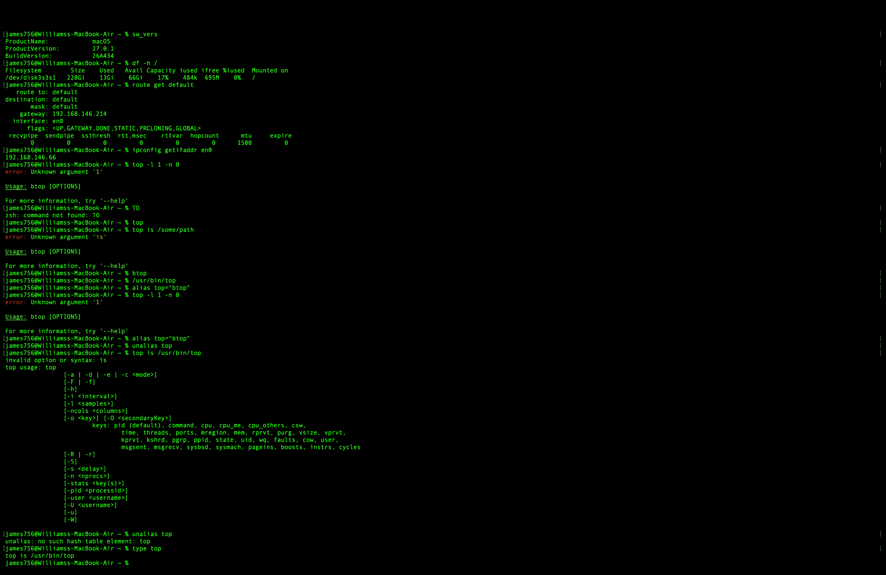
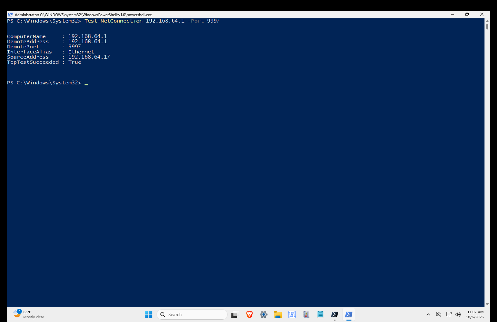
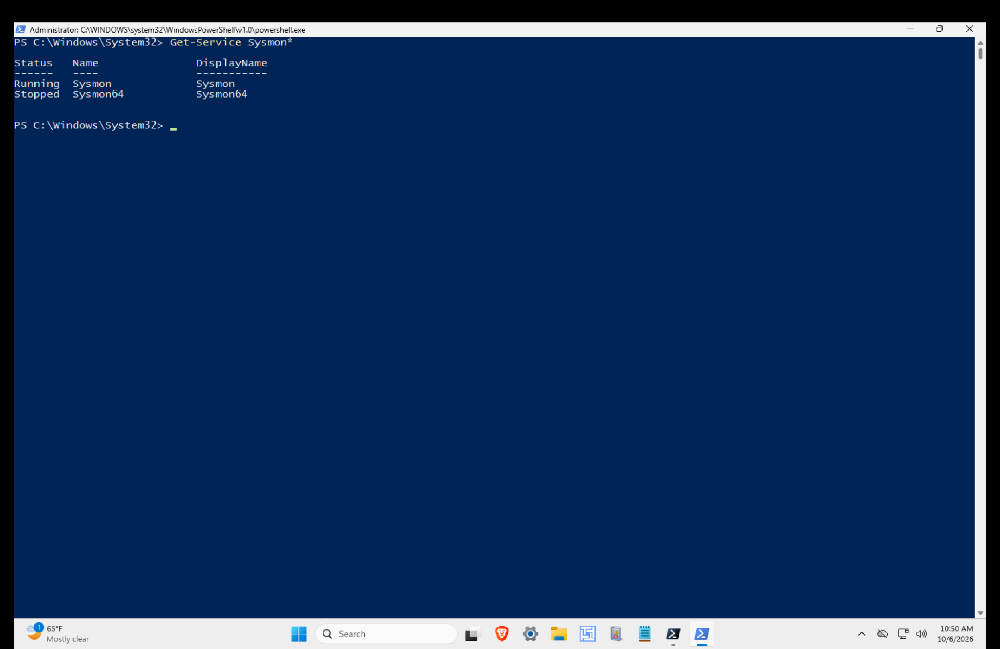

# Day 1: Environment Baseline

## Overview

Day 1 of my StegaShield detection validation pilot establishes the state of the lab before controlled StegaShield testing begins.

The purpose of this investigation is simple:

**Understand what already exists before introducing new variables.**

Without a baseline, later activity could be incorrectly attributed to StegaShield, the HTTPS workflow, Zeek, or the controlled image testing when it may have already existed in the environment.

This investigation covers:

* Mac M2 host
* Windows endpoint
* Ubuntu server
* Splunk Enterprise
* Splunk Universal Forwarder
* Sysmon
* Docker
* Firewall state
* Existing services
* Network connectivity
* Time synchronization
* Background activity

No StegaShield performance conclusions are made on Day 1.

---

## Lab Roles

| System | Role | Address |
| --- | --- | --- |
| Mac M2 | Splunk Enterprise and lab host | 192.168.146.66 on current host network |
| Windows | Simulated corporate endpoint | 192.168.64.17 |
| Ubuntu 24.04 | Controlled server environment | 192.168.64.12 |

The Windows and Ubuntu VMs communicate across the existing virtual lab network.

The Mac hosts Splunk Enterprise and manages the virtual environment.

---

# 1. Mac Host Baseline

The host is an Apple M2 Mac with 8 GB of memory.

At the time of the baseline:

* Hardware: Apple M2
* CPU: 8 cores
* Memory: 8 GB
* macOS: 27.0.1
* Build: 26A434
* Splunk Enterprise: 10.4.0
* Docker CLI: 29.8.1
* Current host IPv4: 192.168.146.66

The host network address differs from historical addresses used in earlier versions of the lab, so previous addressing was not assumed to still be valid.

Sensitive hardware identifiers such as the serial number, UUID, and device identifiers are intentionally excluded from the public evidence.

### Evidence 1: Mac Host Baseline



This evidence establishes the physical host and operating environment supporting the pilot.

---

# 2. Splunk Baseline

Splunk Enterprise was already installed on the Mac before this pilot.

The configured receiving port was:

```text
TCP 9997
```

However, checking the service revealed that Splunk was not running.

This mattered because the Windows endpoint depends on the Splunk Universal Forwarder sending telemetry to the Mac on TCP 9997.

## Expected

```text
Windows
   |
Splunk Universal Forwarder
   |
TCP 9997
   |
Mac Splunk Enterprise
```

## Observed

Splunk was installed and the receiving configuration existed, but `splunkd` was not running.

The initial Windows connectivity test to TCP 9997 therefore failed.

This was an important baseline finding because a failed telemetry path could otherwise have been mistaken for a problem introduced later in the pilot.

### Evidence 2: Splunk Initial State and Recovery



## Corrective Change

Splunk was started.

Starting Splunk also generated new certificates under the existing Splunk authentication directory.

That means the action changed system state and is documented rather than being presented as part of the untouched original baseline.

## Verification

After Splunk started:

* `splunkd` was running
* TCP 9997 was listening
* Splunk Web was available locally
* Windows could reach TCP 9997
* The Windows Splunk forwarder established a connection

The troubleshooting chain was:

```text
Expected telemetry flow
        |
        v
TCP 9997 test failed
        |
        v
Splunk found stopped
        |
        v
Splunk started
        |
        v
TCP 9997 listening
        |
        v
Windows connection established
        |
        v
Telemetry verified in Splunk
```

---

# 3. Windows Endpoint Baseline

The Windows VM is the simulated corporate endpoint for the pilot.

Baseline state:

| Field | Value |
| --- | --- |
| Hostname | JAMES-VM |
| Operating System | Windows 10 Home |
| Display Version | 25H2 |
| Build | 26200.9550 |
| Logical CPUs | 4 |
| Memory | 3.99 GB |
| System Drive | 63 GB |
| Free Space | 24.31 GB |
| IPv4 | 192.168.64.17 |
| Gateway | 192.168.64.1 |

An earlier assumption that this VM was Windows 11 was incorrect.

The baseline therefore records the operating system reported by the system itself rather than carrying the historical assumption into the pilot.

### Evidence 3: Windows System Baseline


This screenshot establishes the endpoint identity, operating system, resources, and network state before controlled testing.

---

# 4. Sysmon Baseline

Sysmon was already installed before the pilot.

The active service was:

```text
Sysmon
```

A second `Sysmon64` service existed but was stopped.

It was not started because the objective was to document the existing telemetry state rather than introduce an unnecessary change.

The active configuration was:

```text
C:\Windows\System32\sysmonconfig-swift.xml
```

Configuration SHA256:

```text
055FEBC600E6D7448CDF3812307275912927A62B1F94D0D933B64B294BC87162
```

The configuration includes telemetry such as process creation and file creation.

Network connection logging is enabled but filtered.

This distinction matters later in the pilot because the absence of a Sysmon network event cannot automatically be interpreted as the absence of network activity.

### Evidence 4: Sysmon Baseline



This evidence establishes the endpoint telemetry source and an important visibility limitation before testing begins.

---

# 5. Windows to Splunk Telemetry

The Windows Splunk Universal Forwarder was already installed and running.

Version:

```text
10.2.2
```

The configured destination was:

```text
192.168.64.1:9997
```

After Splunk was restored on the Mac, an established TCP connection was observed from:

```text
192.168.64.17
```

to:

```text
192.168.64.1:9997
```

The connection belonged to the Splunk forwarder process.

A Splunk search for `JAMES-VM` over the previous 24 hours returned **4,062 events**.

Observed sources included:

| Source | Events |
| --- | ---: |
| Windows Security | 1,965 |
| Sysmon | 1,155 |
| PowerShell | 583 |
| System | 248 |
| Application | 86 |
| Windows Defender | 25 |

### Evidence 5: Windows Telemetry in Splunk


This proves the following telemetry path was operational:

```text
JAMES-VM
   |
Splunk Universal Forwarder
   |
TCP 9997
   |
Splunk Enterprise
```

It does **not** prove that StegaShield telemetry exists.

It does **not** prove that HTTPS image transfers are visible.

It does **not** prove image content can be inspected.

It proves that the existing Windows telemetry pipeline into Splunk is operational.

---

# 6. Ubuntu Server Baseline

Ubuntu provides the controlled server side of the pilot.

Baseline state:

| Field | Value |
| --- | --- |
| Hostname | ubuntu |
| OS | Ubuntu 24.04.5 LTS |
| Kernel | 6.8.0-146-generic |
| Architecture | ARM64 |
| CPUs | 4 |
| Memory | 4.3 GiB |
| Root Filesystem | 30 GB |
| Root Used | 16 GB |
| IPv4 | 192.168.64.12 |
| Interface | enp0s1 |

The VM originally used the hostname:

```text
wazuh-manager
```

That hostname reflected an older lab role.

It was changed to:

```text
ubuntu
```

during Day 1.

This is documented as a deliberate baseline change and not presented as the original state.

Sensitive identifiers such as Machine ID and Boot ID are excluded from public evidence.

### Evidence 6: Ubuntu System and Network Baseline


---

# 7. Docker and Existing Services

Docker was already installed on Ubuntu.

Version:

```text
Docker 29.1.3
```

The Docker service was active.

The normal user did not have permission to access the Docker socket directly.

Using elevated privileges showed that there were no existing Docker containers.

This is important because future StegaShield containers can be distinguished from the original Day 1 state.

Existing services and listeners included:

* SSH on TCP 22
* Apache on TCP 80
* Samba services
* Local system services
* Wazuh agent

There was no HTTPS listener on TCP 443 during the baseline.

StegaShield had not yet been deployed as part of the controlled pilot workflow.

Zeek had not yet been deployed as part of the controlled pilot workflow.

### Evidence 7: Ubuntu Services, Docker and Firewall


---

# 8. Firewall Baseline

UFW was active on Ubuntu.

The baseline policy was:

```text
Incoming: deny
Outgoing: allow
Routed: deny
```

Existing allowances included services from previous lab work.

A Windows test to Ubuntu TCP 80 failed even though Apache was listening.

IP connectivity was successful.

This distinction demonstrated that:

```text
Host reachable
```

does not automatically mean:

```text
Application port reachable
```

The firewall state therefore becomes important when the HTTPS receiver is introduced later in the pilot.

No firewall rule was opened simply to make the Day 1 baseline appear successful.

---

# 9. Existing Wazuh Background Activity

The Ubuntu VM also contained an inherited Wazuh agent from previous lab work.

The agent was active and configured for the old manager address:

```text
192.168.64.1
```

Repeated connection attempts to Wazuh ports were failing because no corresponding manager listener was available.

This traffic existed **before StegaShield testing**.

That makes it important background noise.

If similar network activity appears during later packet or network analysis, it should not automatically be attributed to the StegaShield workflow.

The Wazuh configuration was not repaired during the baseline because doing so would introduce another unrelated change.

---

# 10. Network Connectivity

Network connectivity between the two VMs was tested rather than assumed.

Ubuntu:

```text
192.168.64.12
```

Windows:

```text
192.168.64.17
```

Ubuntu successfully reached Windows with:

```text
4 packets transmitted
4 packets received
0% packet loss
```

Windows also demonstrated IP level reachability to Ubuntu.

### Evidence 8: Ubuntu to Windows Connectivity


This establishes basic bidirectional IP reachability between the systems that will later participate in the controlled transfer workflow.

It does not establish that HTTPS is configured.

It does not establish that TCP 443 is reachable.

Those are separate validation steps for later in the pilot.

---

# 11. Time Synchronization

Time consistency matters because later investigations will correlate events from multiple systems.

The systems were using different local time zones:

```text
Mac      PDT
Windows  Pacific Time
Ubuntu   UTC
```

Ubuntu reported synchronized time.

Windows initially produced conflicting evidence.

The Windows Time service initially reported Local CMOS Clock and unsynchronized status.

DNS resolution was also inconsistent during the first check.

After additional validation:

* `time.windows.com` resolved
* NTP communication succeeded
* Windows Time events indicated synchronization activity
* The source changed to `time.windows.com`
* A successful synchronization timestamp was recorded

However, another status output continued to report values inconsistent with a fully healthy synchronized state.

Because the evidence conflicts, I am not documenting Windows time synchronization as completely healthy.

Instead, it remains an evidence gap.

For later correlation, timestamps will be normalized to UTC.

---

# 12. Changes Made During Day 1

A baseline should distinguish the original state from changes made while investigating it.

The following changes occurred during Day 1:

| Change | Reason | Effect |
| --- | --- | --- |
| Started Splunk Enterprise | Restore existing telemetry path | TCP 9997 and Windows ingestion restored |
| Splunk generated new certificates | Consequence of service startup | Authentication files changed |
| Removed custom `top` alias | Restore expected macOS command behaviour | `/usr/bin/top` available normally |
| Renamed Ubuntu hostname | Remove obsolete Wazuh manager role name | Host now identified as `ubuntu` |
| Changed Ubuntu shell prompt | Remove inherited cosmetic prompt | Standard prompt restored |

No StegaShield component was deployed.

No controlled steganographic image was generated.

No Zeek deployment was performed.

No HTTPS receiver was configured.

Those activities belong to later stages of the pilot.

---

# 13. Troubleshooting Record

## Splunk Telemetry Path

### Symptom

Windows could not reach the configured Splunk receiving port.

### Expected

```text
JAMES-VM -> TCP 9997 -> Splunk Enterprise
```

### Actual

TCP 9997 was unreachable.

### Hypothesis

The problem was on the receiving side rather than the Windows forwarder.

### Evidence

Splunk Enterprise was installed but `splunkd` was not running.

### Change

Splunk was started.

### Verification

TCP 9997 began listening.

Windows successfully connected.

An established forwarder connection was observed.

Windows events were searchable in Splunk.

### Root Cause

The existing Splunk service was stopped.

### Lesson

A broken telemetry path does not automatically mean the forwarder, firewall, or network configuration is broken.

Validate each layer independently.

---

# 14. Analysis

## Observed

* Windows endpoint address was 192.168.64.17
* Ubuntu address was 192.168.64.12
* Windows and Ubuntu had IP level connectivity
* Sysmon was running on Windows
* Splunk Universal Forwarder was installed and running
* Splunk Enterprise was initially stopped
* TCP 9997 became reachable after Splunk was started
* Windows telemetry became searchable in Splunk
* Docker was installed and active on Ubuntu
* No Docker containers existed
* UFW was active
* Apache, SSH, Samba, and Wazuh were inherited services
* No HTTPS listener existed on TCP 443
* Wazuh was generating failed connection attempts to its old manager
* StegaShield had not yet been introduced into the controlled workflow
* Zeek had not yet been introduced into the controlled workflow

## Correlated

The following telemetry path was verified:

```text
Windows
   |
Splunk Universal Forwarder
   |
TCP 9997
   |
Splunk Enterprise
```

The following network relationship was also established:

```text
Windows 192.168.64.17
        <= IP connectivity =>
Ubuntu 192.168.64.12
```

## Interpretation

The environment is suitable to proceed to controlled dataset preparation, but it is not a clean laboratory environment with zero background activity.

Existing services, firewall rules, Wazuh connection attempts, telemetry filters, and time synchronization behaviour must be considered during later investigations.

The baseline gives me a known reference point for distinguishing existing activity from activity introduced by the pilot.

## Unknown

Day 1 does not establish:

* How StegaShield scores clean images
* How StegaShield scores LSB modified images
* Whether StegaShield produces false positives
* Whether StegaShield produces false negatives
* Whether results are repeatable
* How useful Zeek will be in the final workflow
* How the HTTPS transfer path will behave
* Whether all relevant endpoint activity will be captured
* Whether StegaShield evidence will improve SOC investigation confidence

Those questions belong to later stages of the pilot.

---

# 15. Evidence Gaps

## Windows Time State

Windows produced evidence of successful NTP communication while another status view continued to report values inconsistent with a fully synchronized state.

The discrepancy remains documented rather than being forced into a clean conclusion.

## Sysmon Network Visibility

Sysmon network connection logging is enabled but filtered.

Future absence of a Sysmon network event therefore cannot automatically be interpreted as proof that a network connection did not occur.

## Existing Background Services

The environment contains inherited services from earlier lab work.

Later network analysis must distinguish pilot activity from this pre existing traffic.

---

# 16. Day 1 Disposition

**PROCEED TO DAY 2**

The environment baseline is sufficiently documented to begin controlled dataset and ground truth preparation.

Day 1 does not validate StegaShield.

It establishes the reference state required to validate StegaShield properly later.

---

# 17. Day 1 Lesson

The most important lesson from Day 1 was that establishing a baseline is more than recording IP addresses and system specifications.

The investigation uncovered:

* A stopped Splunk service
* A broken telemetry path
* Existing firewall restrictions
* Inherited Wazuh traffic
* Existing server services
* Sysmon visibility limitations
* A Windows time synchronization discrepancy
* Historical assumptions that no longer matched the current environment

Without documenting those conditions first, later pilot activity could easily be misinterpreted.

The baseline now gives the rest of the investigation something to compare against.

---

## Next Investigation

**Day 2: Dataset and Ground Truth**

The next stage will create the controlled image dataset and establish the known identity of every sample before StegaShield is allowed to influence the analysis.
