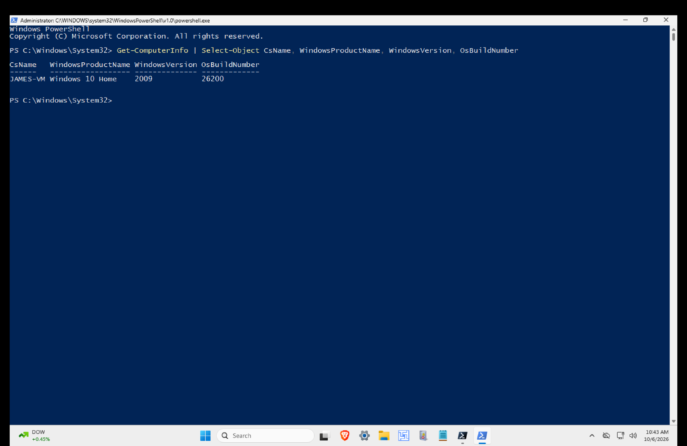
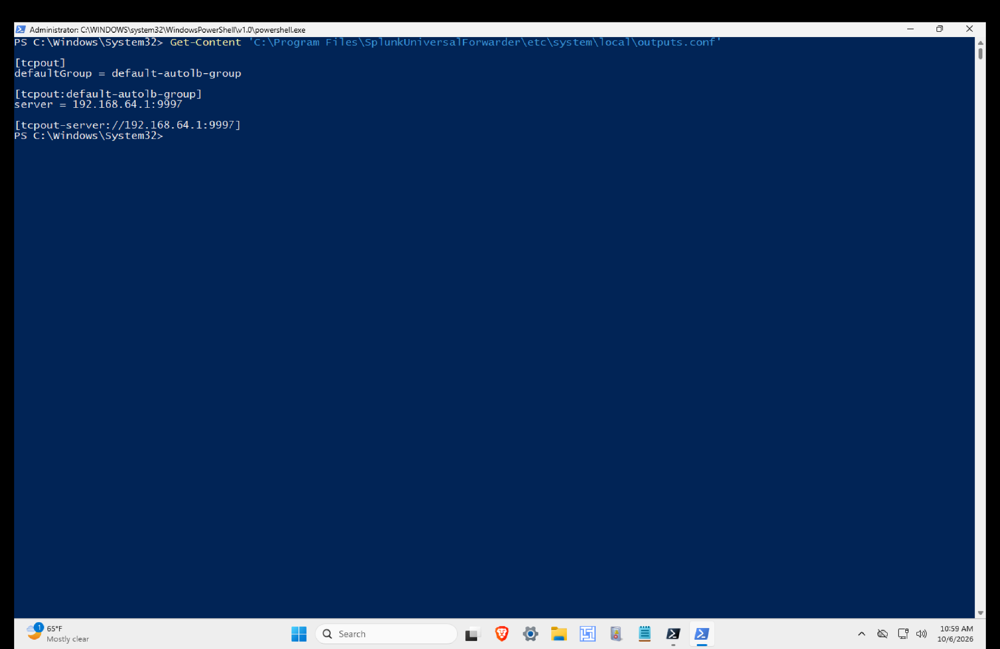
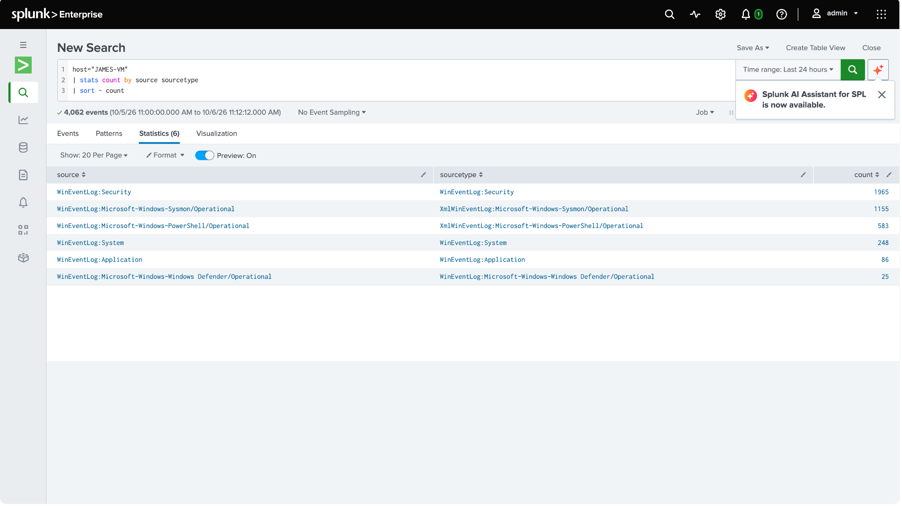
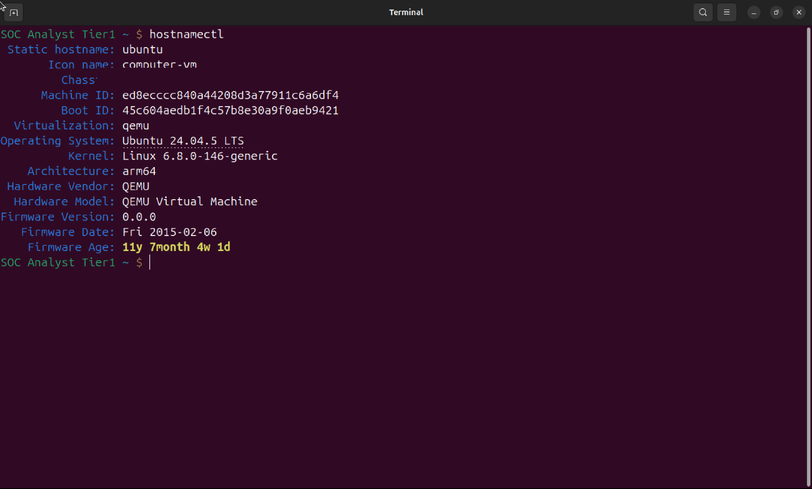
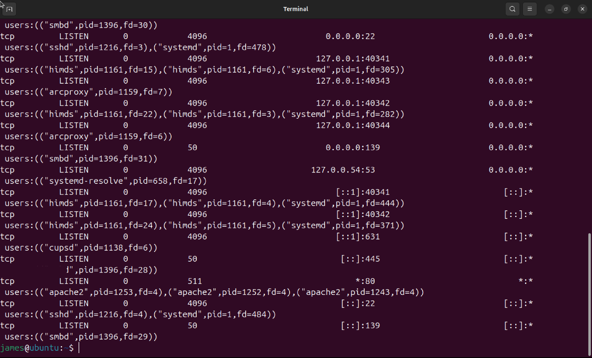
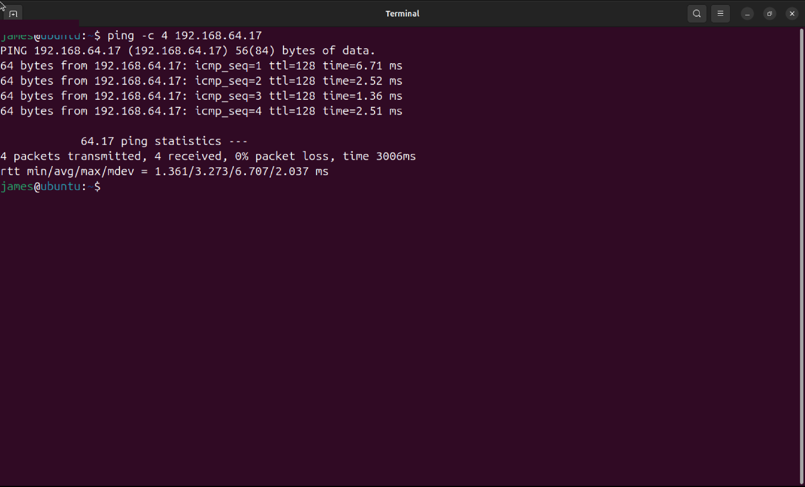

# Environment Baseline

## Overview

Day 1 establishes the environment baseline for my StegaShield detection validation pilot before any controlled steganography testing begins.

The goal was to understand the existing state of the lab, verify the telemetry path, identify inherited services and background activity, and document any changes made during baseline collection.

This gives me a known starting point before I introduce controlled images, StegaShield, Zeek, and the HTTPS testing workflow.

---

## Lab Roles

The pilot uses three systems:

**Mac M2 Host**
- SOC analysis system
- Splunk Enterprise
- Lab management

**Windows Endpoint**
- Hostname: `JAMES-VM`
- IP address: `192.168.64.17`
- Controlled endpoint
- Sysmon
- Windows Event Logs
- Splunk Universal Forwarder

**Ubuntu Server**
- Hostname: `ubuntu`
- IP address: `192.168.64.12`
- Controlled server
- Future StegaShield host
- Future HTTPS receiver
- Future Zeek sensor

The purpose of Day 1 was not to deploy those future components.

The purpose was to document what already existed before testing.

---

# Mac Host Baseline

The Mac is the SOC analysis host for this pilot.

The baseline confirmed:

- Apple M2
- 8 CPU cores
- 8 GB RAM
- macOS 27.0.1
- Splunk Enterprise installed
- Splunk version 10.4.0
- Docker client installed

The Mac hosts the central SIEM used for correlation.

The original Mac terminal screenshot is intentionally not included in the public evidence because it contains unnecessary host identifying information.

---

# Windows Endpoint Baseline

The Windows endpoint is:

```text
Hostname: JAMES-VM
IP: 192.168.64.17
```

The baseline identified:

- Windows 10 Home
- DisplayVersion 25H2
- Build 26200.9550
- 4 logical processors
- Approximately 4 GB RAM
- Ethernet interface on `192.168.64.17`
- Default gateway `192.168.64.1`



### Why this matters

This endpoint will later generate the controlled activity used in the StegaShield pilot.

Its original state needs to be known before images are created, modified, transferred, and analyzed.

---

# Sysmon Baseline

Sysmon was already installed on the Windows endpoint.

The baseline showed:

```text
Sysmon      Running
Sysmon64    Stopped
```

The running `Sysmon` service is the relevant service for this environment.


The configuration was also inspected.

Configuration file:

```text
C:\Windows\System32\sysmonconfig-swift.xml
```

The configured hashing algorithms included:

```text
MD5
SHA256
IMPHASH
```

Recent Sysmon telemetry included Event IDs such as:

```text
1   Process Create
11  File Create
```

Network connection monitoring was enabled but filtered.

That limitation matters because future network activity cannot automatically be assumed to appear in Sysmon.

### Why this matters

Later investigations may correlate image creation, processes, file activity, and network behavior.

Understanding the Sysmon configuration first prevents me from assuming visibility that the endpoint does not actually provide.

---

# Splunk Forwarding Configuration

The Splunk Universal Forwarder was already installed and running on Windows.

Its existing output configuration pointed to:

```text
192.168.64.1:9997
```



This established where the Windows endpoint expected to send its telemetry before connectivity was tested.

---

# Splunk Baseline and Troubleshooting

Splunk Enterprise was installed on the Mac, but the first status check showed that `splunkd` was not running.

This immediately affected the Windows telemetry path.

Because Splunk was stopped, the initial TCP 9997 connectivity test from Windows failed.

Splunk was then started as a deliberate corrective action.

After the service started:

- `splunkd` was running
- TCP 9997 was listening
- Splunk Web was available locally
- Windows could establish a connection to the receiver


## Troubleshooting Chain

**Expected**

Windows telemetry should reach Splunk through TCP 9997.

**Observed**

The Windows connection to TCP 9997 initially failed.

**Hypothesis**

The problem was on the receiving side rather than the Windows Universal Forwarder.

**Evidence**

Splunk was installed but `splunkd` was not running.

**Action**

Splunk was started.

**Verification**

TCP 9997 became available and Windows successfully established the forwarding connection.

**Root Cause**

The Splunk service was stopped during the initial baseline.

This was important to document because the recovered state must not be presented as the original baseline state.

---

# Windows to Splunk Telemetry

After the Splunk receiver was restored, the telemetry path was verified.

An established TCP connection existed between:

```text
192.168.64.17
```

and the Splunk receiver on:

```text
TCP 9997
```

The connection was associated with the Windows Splunk Universal Forwarder process.

A Splunk search for `JAMES-VM` confirmed that Windows telemetry was being indexed.

The available telemetry included:

```text
Windows Security
Sysmon
PowerShell
System
Application
Windows Defender
```



## What this proves

The evidence supports this telemetry path:

```text
Windows
   |
Splunk Universal Forwarder
   |
TCP 9997
   |
Splunk Enterprise
```

It does **not** prove:

- StegaShield visibility
- HTTPS image visibility
- hidden content detection
- image exfiltration

Those are separate questions that will be tested later.

---

# Ubuntu Server Baseline

The Ubuntu server is:

```text
Hostname: ubuntu
IP: 192.168.64.12
```

The system baseline identified:

- Ubuntu 24.04.5 LTS
- Kernel 6.8.0-146-generic
- ARM64 architecture
- 4 CPUs
- Approximately 4.3 GiB RAM
- Approximately 30 GB root filesystem
- Primary interface `enp0s1`
- IP address `192.168.64.12/24`



The Machine ID and Boot ID are intentionally redacted from the public evidence.

The hostname was originally:

```text
wazuh-manager
```

It was changed to:

```text
ubuntu
```

because the previous hostname no longer represented the server's role in the pilot.

This was a deliberate Day 1 change and is documented as such.

---

# Ubuntu Services and Firewall Baseline

Ubuntu was not a completely clean server.

Several components already existed before the StegaShield pilot.

Docker was installed and its service was active.

The baseline showed no Docker containers running.

Existing services included:

- SSH
- Apache
- Samba
- Wazuh agent
- Docker

UFW was also active.

Its default policy included:

```text
deny incoming
allow outgoing
deny routed
```

Existing firewall allowances were present from earlier lab work.



### Why this matters

These inherited services can create network traffic, logs, listeners, and background behavior unrelated to StegaShield.

If they are not documented now, they could later be mistaken for pilot activity.

---

# Inherited Wazuh Background Activity

The Ubuntu system already contained a Wazuh agent from earlier lab work.

The agent was active and configured to communicate with:

```text
192.168.64.1
```

using the existing Wazuh ports.

During the baseline, the agent repeatedly attempted to communicate with its previous manager configuration.

No corresponding Wazuh manager listener was available on the Mac during this snapshot.

This means the environment already contains identifiable background network noise.

I did not repair or remove the Wazuh configuration during the initial baseline because doing so would alter the environment before its existing state was documented.

---

# Network Connectivity Baseline

Basic connectivity between the pilot systems was tested.

Ubuntu successfully reached the Windows endpoint:

```text
192.168.64.17
```

The test returned:

```text
4 packets transmitted
4 received
0% packet loss
```



Windows also demonstrated IP level reachability to Ubuntu during connectivity testing.

However, an attempted TCP connection to Ubuntu port 80 failed while IP connectivity remained available.

The existing UFW policy explained why basic reachability did not automatically mean application level access.

### What this proves

The two VMs can communicate at the network layer.

It does **not** prove that the future HTTPS image transfer workflow is working.

That will be established separately.

---

# Time Synchronization Baseline

Time matters because later investigation will correlate events across:

- Windows
- Ubuntu
- Splunk
- Zeek
- StegaShield

The systems were therefore checked before controlled testing.

Ubuntu reported synchronized time with NTP active.

Windows successfully contacted its configured time source during testing, but some Windows time status fields remained inconsistent after synchronization.

Rather than describing Windows time synchronization as completely healthy, I am keeping this as an evidence gap.

For later correlation, timestamps will be normalized to UTC where appropriate.

---

# Changes Made During Day 1

The following changes occurred during baseline collection and are therefore documented separately from the original observed state.

### 1. Splunk Started

Splunk was found stopped.

It was started to restore the existing Windows telemetry path.

### 2. Mac `top` Alias Corrected

The shell contained:

```text
alias top="btop"
```

This prevented the native macOS `top` command from running normally.

The alias was commented and the native command was verified.

### 3. Ubuntu Hostname Changed

The hostname changed from:

```text
wazuh-manager
```

to:

```text
ubuntu
```

The previous hostname represented an older lab role.

### 4. Ubuntu Shell Prompt Changed

The existing custom shell prompt was replaced with a standard prompt.

This was cosmetic and did not change the security architecture.

---

# Day 1 Analysis

## Observed

- Windows endpoint was reachable at `192.168.64.17`.
- Ubuntu was reachable at `192.168.64.12`.
- Sysmon was running on Windows.
- Splunk Universal Forwarder was installed and running.
- Splunk Enterprise was initially stopped.
- Splunk was restored during baseline troubleshooting.
- TCP 9997 became available after Splunk started.
- Windows telemetry was searchable in Splunk.
- Docker was installed on Ubuntu.
- No Docker containers were running during the baseline.
- UFW was active.
- Ubuntu contained inherited services.
- An inherited Wazuh agent was generating failed connection attempts toward its previous manager configuration.
- Basic network reachability existed between Windows and Ubuntu.

---

## Correlated

The Windows Universal Forwarder configuration, TCP 9997 connectivity, and Splunk search results together establish the existing telemetry path:

```text
Windows
   |
Splunk Universal Forwarder
   |
TCP 9997
   |
Splunk Enterprise
```

The Windows and Ubuntu connectivity tests establish basic communication between the two pilot VMs.

---

## Interpretation

The environment is ready to move into controlled dataset and ground truth preparation, but it is **not a clean environment**.

Existing services, firewall rules, Wazuh background activity, and telemetry configuration must be considered during later investigations.

Most importantly:

```text
Connectivity ≠ HTTPS transfer

Telemetry ≠ image visibility

Image transfer ≠ steganography

StegaShield signal ≠ exfiltration
```

Each layer needs to be validated independently.

---

# Unknown

Day 1 does not answer whether:

- StegaShield can distinguish clean images from controlled LSB modified images.
- StegaShield produces repeatable probability scores.
- False positives will occur.
- False negatives will occur.
- Different LSB payload preparation methods affect results.
- Zeek telemetry will provide useful network context.
- StegaShield results become more useful when correlated with endpoint and network telemetry.

Those questions belong to later stages of the pilot.

---

# Evidence Gaps

Two important evidence gaps remain from Day 1.

### Windows Time State

Windows successfully communicated with its configured time source, but some status fields remained inconsistent.

I will therefore avoid claiming that Windows time synchronization was completely healthy.

### Sysmon Network Visibility

Sysmon network connection monitoring is enabled but filtered.

Future network activity cannot automatically be assumed to appear in Sysmon.

---

# Day 1 Disposition

**Proceed to Day 2: Dataset and Ground Truth Preparation.**

The core environment has been baselined.

The Windows endpoint and Ubuntu server can communicate, and the Windows to Splunk telemetry path has been verified.

The next step is to establish controlled ground truth before any image is submitted to StegaShield.

---

# Day 1 Lesson

A baseline is more than recording IP addresses and system specifications.

During this stage I found:

- a stopped Splunk service
- an inherited Wazuh configuration
- existing Ubuntu services
- firewall restrictions
- filtered Sysmon network telemetry
- a Windows time synchronization inconsistency

Each of those conditions could influence what I observe later.

Documenting them now gives the rest of the StegaShield pilot a known starting point.

---

# Evidence

The Day 1 public evidence is stored in:

```text
evidence/
├── 01-windows-system-baseline.png
├── 02-windows-sysmon-baseline.png
├── 03-splunk-forwarding-configuration.png
├── 04-splunk-forwarding-recovery.png
├── 05-splunk-windows-telemetry.png
├── 06-ubuntu-server-baseline.png
├── 07-ubuntu-services-firewall-baseline.png
└── 08-ubuntu-to-windows-connectivity.png
```

Each screenshot supports a specific stage of the baseline rather than being included as decoration.

---

## Next Investigation

**Day 2: Dataset and Ground Truth Preparation**

The next stage will establish the known clean and controlled modified image pairs before StegaShield is allowed to influence any classification decision.
